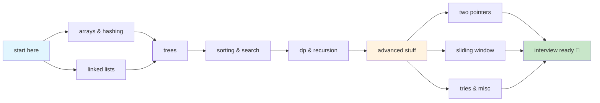

# leetcode notes

my personal study notes for data structures and algorithms. mostly following neetcode roadmap but added my own stuff too.

been grinding leetcode for a few months now and decided to write everything down so i dont forget lol

## what's inside

```
beginner/
├── arrays + hash tables
├── linked lists
├── trees/graphs
├── sorting stuff
└── dp, recursion, backtracking...

advanced/
├── two pointers
├── sliding window
└── tries + other weird stuff

exercise.py - random problems i work on
roadmap.md - data science stuff (ignore this)
```

## how to use this

start with beginner folder, do the problems in exercise.py, then move to advanced when you're ready



topics im covering:
- arrays, linked lists, trees, graphs
- sorting, binary search, hash maps
- dynamic programming (still struggling with this one)
- recursion, backtracking
- two pointers, sliding window
- bit manipulation, heaps

mostly for faang prep but honestly just trying to get better at coding interviews in general