# leetcode notes

my personal study notes for data structures and algorithms. mostly following neetcode roadmap but added my own stuff too.

been grinding leetcode for a few months now and decided to write everything down so i dont forget lol

## what's inside

```
beginner/
├── arrays + hash tables
├── linked lists
├── trees/graphs
├── sorting stuff
└── dp, recursion, backtracking...

advanced/
├── two pointers
├── sliding window
└── tries + other weird stuff

exercise.py - random problems i work on
roadmap.md - data science stuff (ignore this)
```

## how to use this

start with beginner folder, do the problems in exercise.py, then move to advanced when you're ready

```mermaid
graph LR
    A[start here] --> B[arrays & hashing]
    A --> C[linked lists]
    B --> D[trees]
    C --> D
    D --> E[sorting & search]
    E --> F[dp & recursion]
    F --> G[advanced stuff]
    G --> H[two pointers]
    G --> I[sliding window]
    G --> J[tries & misc]
    H --> K[interview ready 🎯]
    I --> K
    J --> K

    style A fill:#e1f5fe
    style K fill:#c8e6c9
    style G fill:#fff3e0
```



topics im covering:
- arrays, linked lists, trees, graphs
- sorting, binary search, hash maps
- dynamic programming (still struggling with this one)
- recursion, backtracking
- two pointers, sliding window
- bit manipulation, heaps

mostly for faang prep but honestly just trying to get better at coding interviews in general